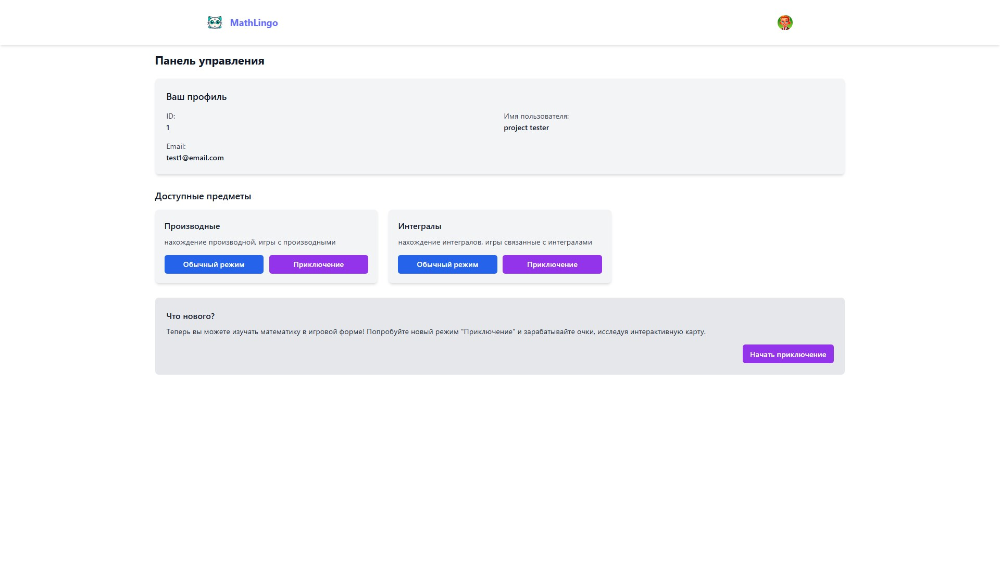
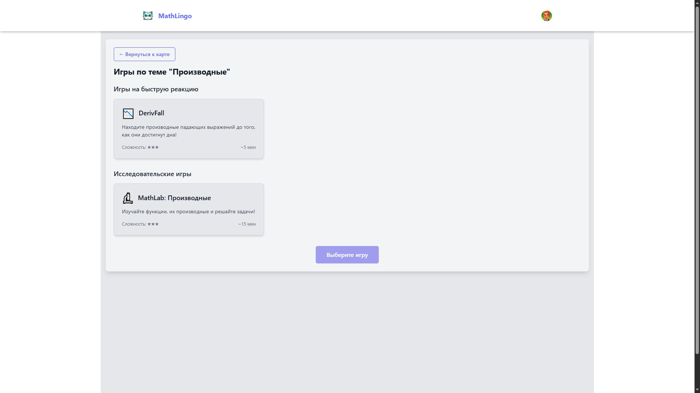
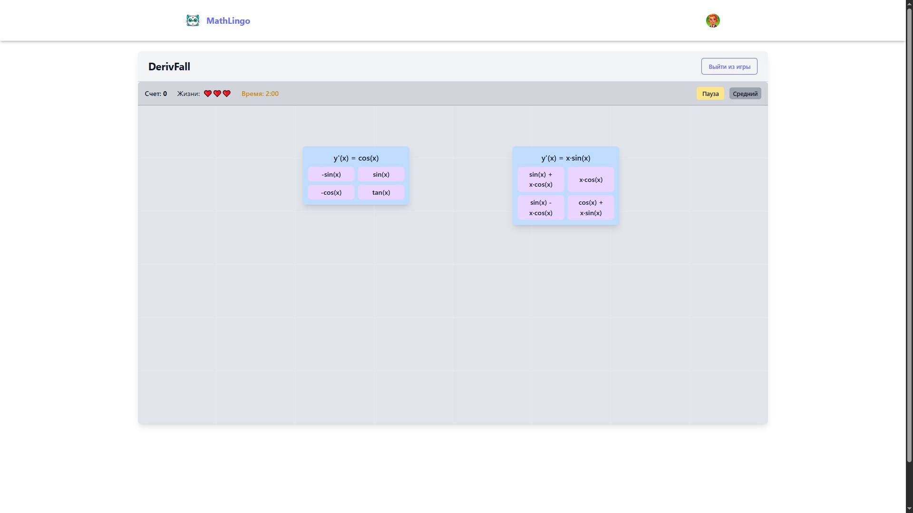

# MathLingo

<div align="center">
  
  
  <p><strong>Изучайте математику бесплатно, весело и эффективно!</strong></p>
  
  
  
  
</div>

## 📋 О проекте

MathLingo — это интерактивная образовательная платформа для изучения математики. Проект сочетает в себе серьезный образовательный контент с элементами геймификации, предлагая пользователям увлекательный путь к освоению математических концепций, включая производные, интегралы и другие разделы математики.

### ✨ Ключевые особенности

- **Интерактивные уроки и задания** в различных форматах
- **Игровые механики** для повышения вовлеченности и мотивации
- **Режим приключения** с картой прогресса и наградами
- **Адаптивная система сложности** заданий
- **Разнообразные игры** для закрепления материала: DerivFall, IntegralBuilder, MathLab
- **Светлая и темная темы** оформления
- **Админ-панель** для управления контентом и пользователями

## 📸 Демонстрация

<div align="center">
  <details>
    <summary>📱 Скриншоты (нажмите, чтобы развернуть)</summary>
    <p>Главная страница</p>
    
    <p>Игровой режим</p>
    
    <p>Демонстрация игры</p>
    
  </details>
</div>

## 🔧 Технологический стек

### Backend

- **Python**
- **FastAPI** — современный высокопроизводительный веб-фреймворк
- **PostgreSQL** — реляционная база данных
- **SQLAlchemy** — ORM для работы с базой данных
- **Alembic** — миграции базы данных
- **Pydantic** — валидация данных
- **JWT** — аутентификация пользователей
- **Docker** — контейнеризация приложения

### Frontend

- **React** — библиотека для создания пользовательских интерфейсов
- **TypeScript** — типизированный JavaScript
- **Vite** — быстрая сборка проекта
- **TailwindCSS** — утилитарный CSS-фреймворк
- **React Router** — маршрутизация на клиенте
- **Recharts** — создание интерактивных графиков
- **MathJS** — библиотека для математических операций

## 🚀 Установка и запуск

### Предварительные требования

- Docker и Docker Compose
- Node.js (v16+)
- Python 3.9+

### Backend

1. Перейдите в директорию backend:
   ```bash
   cd mathlingo-backend
   ```

2. Создайте файл .env на основе примера:
   ```bash
   cp .env.example .env
   ```

3. Запустите контейнеры Docker:
   ```bash
   docker-compose up -d
   ```

4. Примените миграции базы данных:
   ```bash
   docker-compose exec backend alembic upgrade head
   ```

### Frontend

1. Перейдите в директорию frontend:
   ```bash
   cd mathlingo-frontend
   ```

2. Установите зависимости:
   ```bash
   npm install
   ```

3. Создайте файл .env на основе примера:
   ```bash
   cp .env.example .env
   ```

4. Запустите приложение в режиме разработки:
   ```bash
   npm run dev
   ```

5. Для сборки продакшн-версии:
   ```bash
   npm run build
   ```

## 📁 Структура проекта

```
./mathlingo
├── mathlingo-backend        # Backend на FastAPI
│   ├── alembic              # Миграции базы данных
│   ├── app                  # Основной код приложения
│   │   ├── database.py      # Настройки подключения к БД
│   │   ├── models.py        # Модели SQLAlchemy
│   │   ├── routes           # Маршруты API
│   │   └── schemas.py       # Схемы Pydantic
│   ├── Dockerfile           # Файл для сборки Docker-образа
│   ├── requirements.txt     # Зависимости Python
│   └── main.py              # Точка входа в приложение
│
└── mathlingo-frontend       # Frontend на React/TypeScript
    ├── public               # Статические файлы
    │   └── avatars          # Аватары пользователей
    ├── src                  # Исходный код
    │   ├── api              # Запросы к API
    │   ├── components       # React-компоненты
    │   │   ├── admin        # Компоненты админ-панели
    │   │   ├── adventure    # Компоненты режима приключений
    │   │   ├── games        # Компоненты игр
    │   │   └── ui           # UI-компоненты
    │   ├── context          # React-контексты (Auth, Theme)
    │   ├── hooks            # Кастомные React-хуки
    │   ├── pages            # Страницы приложения
    │   ├── styles           # Стили и CSS
    │   └── utils            # Вспомогательные функции
    ├── index.html           # Входной HTML-файл
    ├── package.json         # Зависимости и скрипты
    ├── tsconfig.json        # Настройки TypeScript
    └── vite.config.ts       # Настройки Vite
```

## 🛠 Разработка и вклад в проект

Если вы хотите внести вклад в проект MathLingo, пожалуйста, следуйте этим шагам:

1. Форкните репозиторий
2. Создайте ветку для вашей фичи: `git checkout -b feature/amazing-feature`
3. Зафиксируйте изменения: `git commit -m 'Add amazing feature'`
4. Отправьте ветку: `git push origin feature/amazing-feature`
5. Создайте Pull Request

## 📝 Планы на будущее

- [ ] Добавление новых разделов математики
- [ ] Расширение игрового функционала
- [ ] Социальные функции и таблицы лидеров
- [ ] Мобильное приложение
- [ ] API для интеграции с другими образовательными платформами

## 📄 Лицензия

Этот проект распространяется под лицензией MIT. Подробности смотрите в файле `LICENSE`.
